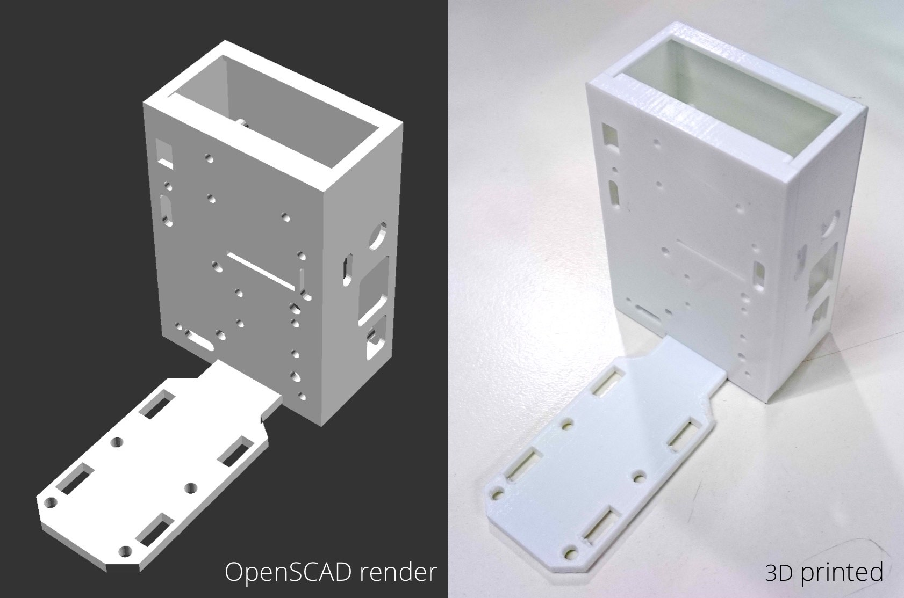

# Raspberry Pi Growth Chamber Cases

Models for Raspberry Pi cases in growth chambers. Optimized for FDM 3D printing.

- Includes configurable cover for attachment of multiple sensor and imaging
  systems.
- Multiple attachment points for easy mounting without additional drilling.
- Large tolerances allow usage on entry-level FDM printers.

## Initial design notes
- Use debugging options to ensure chiral components are properly aligned for top
  and bottom.
- Doesn't work well with supports; ports should be within overhang parameters
  for most printers.
- Mounting flap shape designed in Inkscape and exported with the Inkscape to
  OpenSCAD converter plugin.

## Changelog

### 1.07.1
- Moved to Git.
